<div align="center">

  

  <a href="https://github.com/Theani7">
    
  </a>

  <p>
    
    
    
  </p>

</div>

<div align="center">
  
</div>

---

### `theani7@ai:~$ whoami`

```bash
$ whoami --verbose
> name: Anil Paneru
> alias: theani7
> role: AI Engineer
> location: Kathmandu, Nepal [open :: remote_worldwide]
> portfolio: https://anilpaneru.com.np
> email: theanilpaneru@gmail.com
> mission: turn prompts + papers into production systems
```

---

### `theani7@ai:~$ cat ./about.json`

```json
{
  "code": ["Python", "SQL"],
  "ai_stack": ["LangChain", "LlamaIndex", "OpenAI", "HuggingFace", "RAG", "Agents", "Vector_DBs"],
  "backend": ["FastAPI", "PostgreSQL", "Redis", "Docker"],
  "ops": ["Git", "Linux", "Jupyter", "VS_Code"],
  "currently_building": "autonomous agents + production-grade RAG pipelines",
  "currently_learning": ["agentic workflows", "evals", "fine-tuning", "multimodal LLMs"],
  "hireable": true,
  "coffee": "required_for_inference"
}
```

---

### `theani7@ai:~$ ls -la ./stack/`

<div align="center">

[](https://skillicons.dev)

<p>
  
  
  
  
  
  
  
  
  
</p>

```bash
total 9
drwxr-xr-x  ai  agents  rag  llms  apis  vector_dbs
$ echo $PATH
> /usr/local/bin:/python:/langchain:/production
```

</div>

---

### `theani7@ai:~$ ./run builds --list`

| pid | process | desc |
|---|---|---|
| 001 | `agents/` | autonomous LangChain tool-calling agents that do real work |
| 002 | `rag/` | ingest → chunk → embed → retrieve → generate, evaluated |
| 003 | `llm_apps/` | chatbots, copilots, internal tools (OpenAI + OSS LLMs) |
| 004 | `infra/` | FastAPI + Docker + pgvector / Chroma / Pinecone |

```bash
$ ./deploy --prod
> [+] Build successful in 1.2s
> [!] root access granted: shipping intelligent systems
```

---

### `theani7@ai:~$ htop ./github --stats`

<div align="center">

  
  

  <br/>

  
  

  <br/>

  

```bash
$ uptime --contribs
> load average: commits commits commits
```

</div>

---

### `theani7@ai:~$ ./snake --play`

<div align="center">

  <picture>
    <source media="(prefers-color-scheme: dark)" srcset="https://raw.githubusercontent.com/Theani7/Theani7/output/github-contribution-grid-snake-dark.svg" />
    <source media="(prefers-color-scheme: light)" srcset="https://raw.githubusercontent.com/Theani7/Theani7/output/github-contribution-grid-snake.svg" />
    
  </picture>

```bash
$ ./snake --status
> score: 1337 | eating all your green squares...
```

</div>

---

### `theani7@ai:~$ ssh connect@theani7`

<div align="center">

  <a href="https://github.com/Theani7"></a>
  <a href="https://www.linkedin.com/in/theanilpaneru/"></a>
  <a href="https://anilpaneru.com.np"></a>
  <a href="mailto:theanilpaneru@gmail.com"></a>

```bash
$ echo "let's build something intelligent" | mail theanilpaneru@gmail.com
> message queued... response time: <24h
$ ping anilpaneru.com.np -c 1
> 64 bytes from Kathmandu: time=awesome
```

</div>

---

<div align="center">

  

  <br/>

  

  ```console
  theani7@ai:~$ exit
  logout... see you in the next commit_
  ```

</div>
